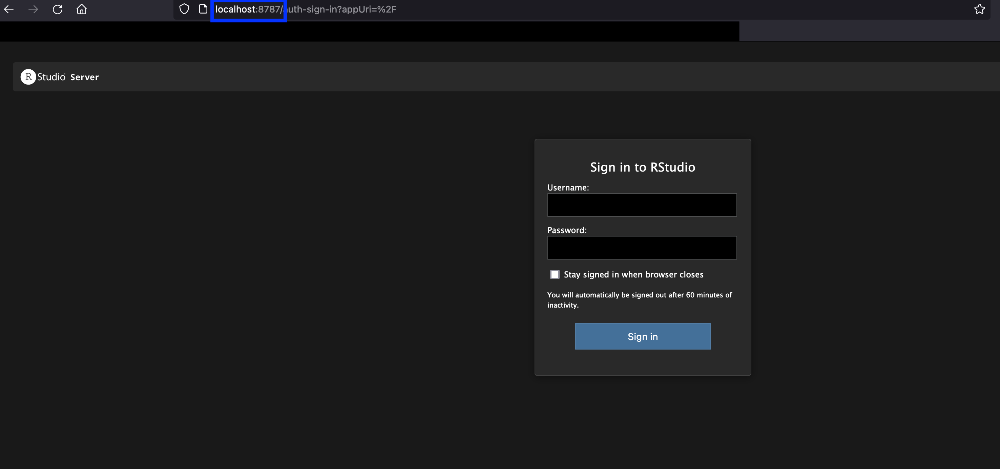
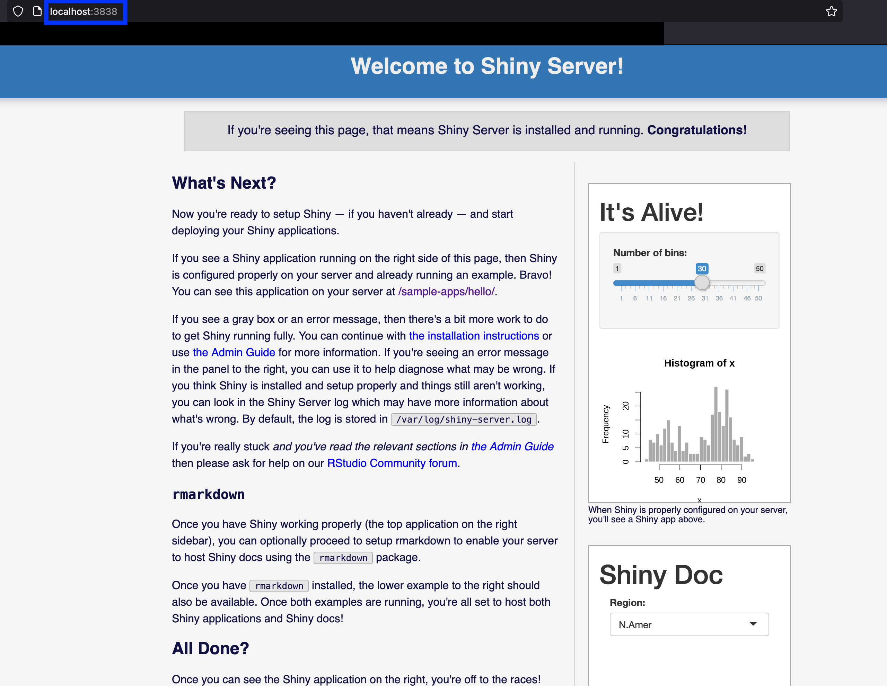
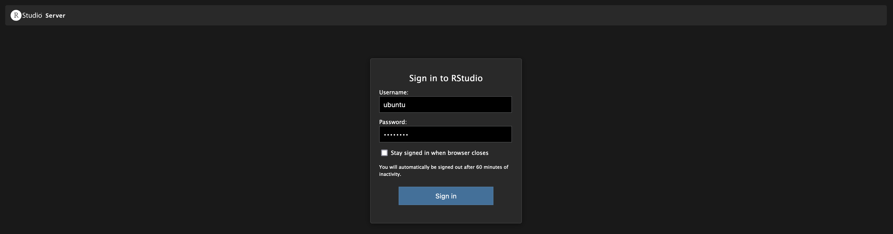
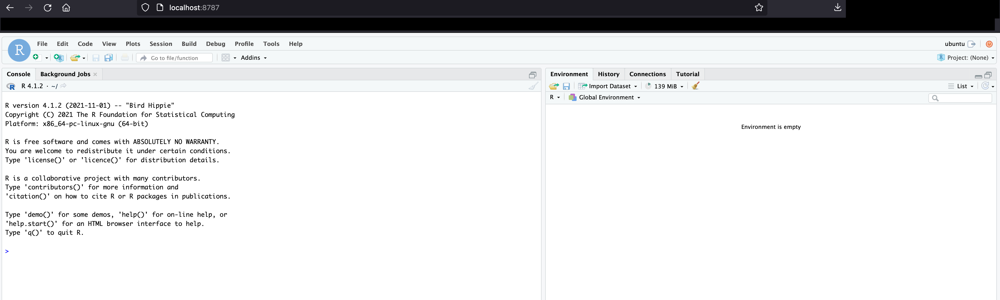

# RStudio & Shiny Server

## Overview

**RStudio Server** is an open source, server edition of the RStudio IDE that runs on a remote machine, giving a browser based experience on scalable infrastructure. 

The benefits to using RStudio Server as opposed to a local version of RStudio Desktop are: 
* Allows users to access the power of R and RStudio via a browser experience, rather than having to configure software locally
* Gives access to greater computational power (resources of the server vs local machine) and moves computation (potentially) closer to where data is stored
* Offers easy ability to scale - the server can be switched to a higher spec instance as required 

See more information on [RStudio Server here](https://posit.co/products/open-source/rstudio-server/). 

**Shiny Server** is open source software that allows the hosting of multiple Shiny applications. Shiny applications deliver interactive, dashboard style visual analytics. Shiny can be a good way for data scientists/analysts to start producing visual content as the apps are defined using familiar R code. 

See [Open source Shiny Server](https://posit.co/products/open-source/shinyserver/) for more information. 

This repo gives a demonstration of how RStudio Server and Shiny Server can be provisioned and set up on an EC2 instance using infrastructure as code. In this example, both RStudio Server and Shiny Server are deployed on the same instance, this is only for demo purposes. 

## Deployment Process

The repo demonstrates using Packer to build a custom AMI that has RStudio Server and Shiny Server installed and configured. 

**Required Tools**
The methods described require you to have the aws cli and [session manager plugin for the aws cli](https://docs.aws.amazon.com/systems-manager/latest/userguide/session-manager-working-with-install-plugin.html) installed and you need to authenticate your aws cli.  

You will also need Terraform and Packer. 

### Build the custom image 

Packer is configured to use AWS Systems Manager (SSM) to connect and run the Ansible provisioning. This means that we don't need to set up SSH access or a bastion host etc, connectivity is provided via SSM. If the instance building your image is launched into your default VPC in a public subnet, this method means that the instance can be left with no inbound security group rules, meaning it can be protected from public internet traffic. 

It does mean however, that we do need to assign an IAM instance profile to the build EC2 instance that has an IAM policy allowing SSM management. The name of this instance profile is passed in as the *ami_build_instance_profile_name* defined in [variables.pkr.hcl](./image/variables.pkr.hcl). Example values are included in this file but in particular *ami_build_instance_profile_name* will need to match the name of an existing ec2 instance profile in your account with the right permissions. This prerequisite can be met by creating an instance profile with the *AmazonSSMManagedInstanceCore* managed policy. 

Once prerequisites are met and the variables file updated with your values, you can build the image. From the *image/* directory, run: 
```
packer build .
```

This will cause Packer to build an EC2 instance in the default VPC (unless you specify otherwise) and then run the Ansible playbook defined in the *automation/* directory to configure the instance. 

### Deploy infrastructure 

Once the AMI is built, the custom AMI is available in the account-region to be launched as an EC2 instance. 

The infrastructure in this demonstration is deployed via Terraform as specified in [main.tf](./infra/main.tf). It will deploy: 

* A VPC containing a public subnet, a private subnet and a NAT gateway
* The instance will be deployed into the private subnet to isolate it from the internet, this is important as there is limited authentication on the RStudio Server. Access could be restricted using security groups but instead we will again use AWS Systems Manager to connect. 
* The subnets and instance will be deployed into a single Availability Zone.
* We deploy into a private subnet with a NAT Gateway giving a route out to the public internet to allow easy install of additional R packages or similar. 

Parameters can be passed via the [terraform.tfvars](./infra/terraform.tfvars) (or equivalent) file. Values are given in this file as an example but ensure to update them to your own. 

Pre-requisites to deploy infrastructure: 
* AMI id of the custom image (this is region specific)
* EC2 key pair to associate with the rstudio server instance (region specific)

Once the variables are set, can deploy from the *infra/* directory with 
```
terraform init
terraform apply
```


## Connecting to RStudio Server and the Shiny Server

After the infrastructure has deployed, go the the EC2 console and retrieve the instance id. 

Then set a local SSH config (for example in ~/.ssh/config) like the below:
```
Host rstudio-server
	HostName <instance_id> 
	LocalForward 8787 localhost:8787
	LocalForward 3838 localhost:3838
	User ubuntu
	IdentityFile ~/.ssh/sandbox-ireland.pem
	ProxyCommand aws ssm start-session --target %h --document-name AWS-StartSSHSession
```

This uses AWS Systems Manager to establish the connection. This is why we are able to connect directly to the RStudio Server in a private subnet. 

The *LocalForward* options mean that we can connect to RStudio Server and Shiny server from a local browser. 

To connect using this config, use ```ssh rstudio-server```. This enables us to navigate to: 
* RStudio Server at localhost:8787 in your browser 
* Shiny Server at localhost:3838 in your browser 

It also opens SSH login shell in your terminal.  

You can then use the terminal connection to the instance to create or set a user and password. 

For example
```
sudo passwd ubuntu
```

To set a password for the *ubuntu* user which you can then use to log in. 



On successful login, you should be presented with the RStudio IDE




## Delete resources

To remove the deployed infrastructure, from the *infra/* directory, run ```terraform destroy```

You can then also delete the custom AMI images if no longer required. 


## Notes

IaC code scanned with [checkov](https://github.com/bridgecrewio/checkov). 

Install
```
pip3 install checkov
```

Then to scan
```
checkov --directory .
```