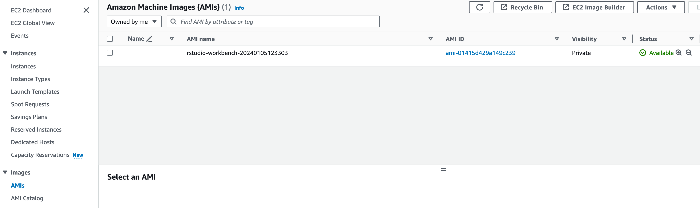
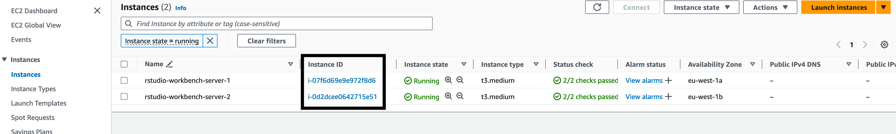
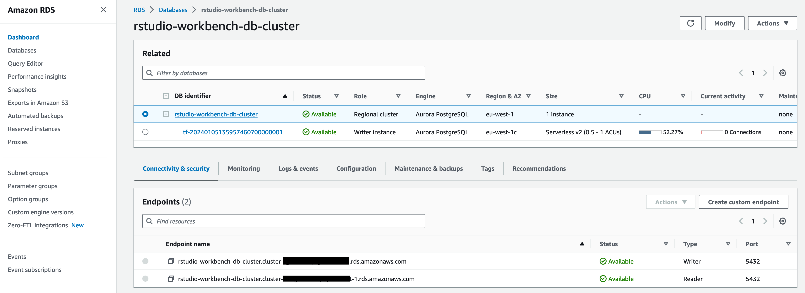
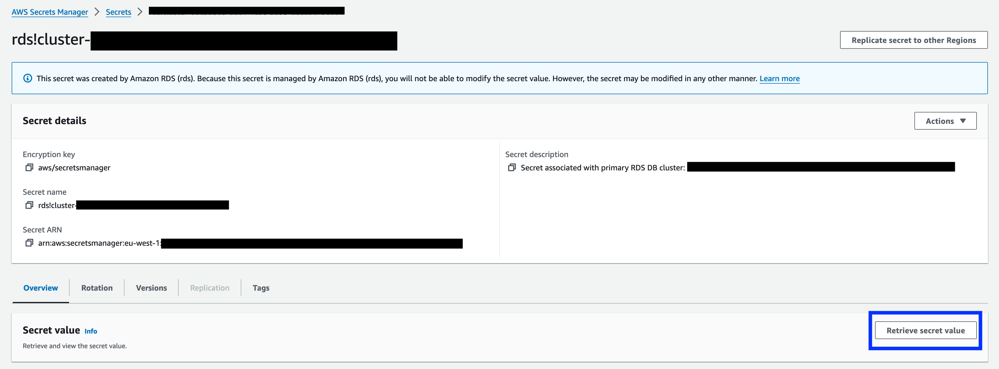
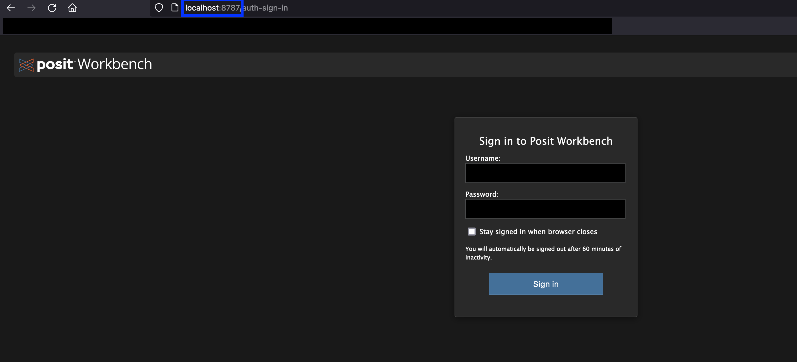
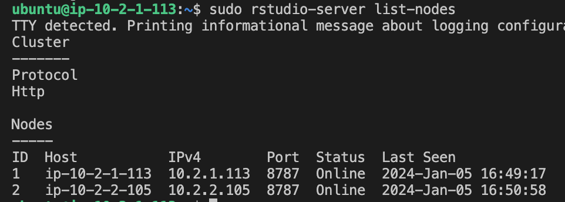
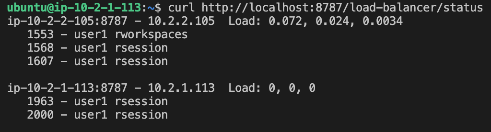

# Posit Workbench multi-server deployment 

## Overview

This repo demonstrates a multi server deployment of Posit Workbench, following the guide here [Multi-server installation](https://docs.posit.co/ide/server-pro/getting_started/installation/multi_server_installation.html) 


## Deployment Architecture Overview 

### Installing workbench on multiple nodes

This process will use Hashicorp Packer to build our own custom AMI with the required Workbench software and other pre-requisites. There are pre-built AMIs available from Posit on AWS Marketplace, but a custom build will give more control over the setup. 


### Postgres database

In a multi server, load balanced set up, a Postgres database is required for Workbench to track session information and other metadata. 

In this deployment, Amazon Aurora Postgres is used to remove the burden of database administration tasks and allow easier scaling. 

### Shared storage 

Again, in a load balanced setup, POSIX compliant shared storage is required to persist user home directories, share project files and store session data. 

In this deployment Amazon Elastic File Storage (EFS) will be used. 


### External load balancer 

Workbench includes an internal load balancer but an external one is recommended for stronger resilience. This demo will just use the internal load balancer. 


## Deployment Process

**Required Tools**  
The methods described require you to have the aws cli and [session manager plugin for the aws cli](https://docs.aws.amazon.com/systems-manager/latest/userguide/session-manager-working-with-install-plugin.html) installed and you need to authenticate your aws cli.  

You will also need Terraform and Packer. 

### Build the AMI
To build the AMI, we will use Packer with an Ansible provisioner. During the build process, Packer creates an EC2 instance that we then run a an Ansible playbook against to configure the instance. 

The Ansible playbook installs and sets the required configuration for workbench. You can see the Ansible playbook in [./image/automation](./image/automation/). Our Ansible provisioner is set to use AWS Systems Manager (SSM) to connect to the instance. So we must specify an EC2 instance profile name which allows SSM management for Packer to attach to the instance. 

This name is set in [variables.pkr.hcl](./image/variables.pkr.hcl) along with other parameters such as AWS region to use. 

To start the AMI build process, set your variables in [variables.pkr.hcl](./image/variables.pkr.hcl) and then from the [image](./image/) directory, run
```
packer build .
```

Once the AMI is built, it is available for our EC2 infrastructure to use. So we can now progress to deploying the infrastructure. You can view the AMI in the *AMIs* section of the EC2 console, as below. 



Packer is set to name the AMI *rstudio-workbench-timestamp*

### Deploy infrastructure with Terraform 

Change to the [infra/](./infra/) directory. 

Set the required variables in the *terraform.tfvars* file (or equivalent). You will need an existing EC2 key that can be used to authenticate to our EC2 instances. The name of this key is passed in as a parameter. 

Once variables are set, deploy with 

```
terraform init
terraform apply
```

### Connect to instances with AWS Systems Manager 

Once deployed, retrieve the EC2 instance ids. 

You get the instance ids for the workbench nodes from the EC2 console



Then set a local SSH configuration for each node as below: 

```
Host rstudio-workbench-server-1
	HostName <instance_id>
	LocalForward 8787 localhost:8787
	User ubuntu
	IdentityFile <path_to_key>
	ProxyCommand aws ssm start-session --target %h --document-name AWS-StartSSHSession
```

The identity key used should be the one corresponding to the EC2 key name specified. This configuration is used to allow specifying multiple *LocalForward* ports. If we only ever need to forward one port, you can just use SSM with the port forwarding option. 

With the above configuration set in your local ssh configuration file (~/.ssh/config) we can ssh to the instance using SSM. 

**Note** you will need to use your instance id for *HostName* and specify your ssh key for *IdentityFile*

Once set up, connect to the instance via 

```
ssh rstudio-workbench-server-1
```

Set a similar configuration for the other server. We are using this approach as we only have 2 servers and for demo purposes. In reality, you may want to use configuration management software to manage automatically connecting to and configuring the servers. 

### Database prerequisites
Once logged into one of the instances, connect to the remote Postgres database in order to create an empty database for workbench to use, as well as a user with appropriately scoped permissions for workbench to connect with. 
Again for demo purposes, the *psql* cli tool was installed on our EC2 instances, in reality you may connect to and manage the database from a different client. 

To connect to the postgres database, use your **writer endpoint name** from the deployed RDS database, this is viewable from your cluster page on the RDS console



To connect, run:

```
psql -h <writer_endpoint> -U postgres --password
```

This will prompt for a password. Retrieve the database password from AWS Secrets Manager (this is because we specified *manage_master_user_password = true* for our RDS database) and enter this at the password prompt. Navigate to the RDS cluster secret on the console and then select *Retrieve secret value* and copy the password, entering it into the psql password prompt. 



When connected to the postgres db, run commands to create a database and role for workbench, as described [here](https://support.posit.co/hc/en-us/articles/1500005822102-Install-and-Configure-PostgreSQL-for-RStudio-Server-Pro). 

On RDS, there is an additional step vs the above link where we must grant the new role to the super user we are logged in as before we can then create the database. 

```
CREATE ROLE rstudio CREATEDB LOGIN PASSWORD 'test';
GRANT rstudio TO postgres;
CREATE DATABASE rstudio WITH OWNER = rstudio;
```

In reality, use a more secure password, this is just for demo purposes. 

### Workbench configuration
Once the database has been set up with the new role and empty database, we must set the corresponding configuration in the */etc/rstudio/database.conf* file that Workbench will look at. 

Exit the psql session with ```\q``` and whilst still logged into the EC2 instance, execute:

```
sudo nano /etc/rstudio/database.conf
```

Set the file to include the following: 

```
# /etc/rstudio/database.conf
# Note: when connecting to a PostgreSQL database, a default empty rstudio database must first be created!
provider=postgresql

# Specifies the host (hostname or IP address) of the database host
host=<rds-writer-endpoint>

# Specifies the database to connect to
database=rstudio

# Specifies the TCP port where the database is listening for connections
port=5432

# Specifies the database connection username
username=rstudio

# Specifies the database connection password. This may be encrypted with the secure-cookie-key.
# The encrypted password can be generated using the helper command rstudio-server encrypt-password.
# It is strongly recommended that you encrypt the password!
password=test

# Specifies the maximum amount of seconds allowed before a database connection attempt
# is considered failed. The default if not specified is 10 seconds. Corresponds to the
# PostgreSQL "connect_timeout=" connection string parameter. 
connection-timeout-seconds=12
```

Be sure to update *host=rds-writer-endpoint* with your endpoint. 

Then run 

```
sudo rstudio-server stop
sudo rstudio-server verify-installation
```

There should be a warning for the plain text password which should not be used in production, but otherwise, the verification should succeed. 

### Encrypt the database password

As per the instructions [here](https://docs.posit.co/ide/server-pro/latest/database/configuration.html) we can encrypt the password so it is no longer plain text. The [Posit docs](https://docs.posit.co/ide/server-pro/database/configuration.html) suggest using SSL client authentication to avoid using a password to connect to the database altogether but this is currently not possible with RDS. 

On the EC2 instance, run:

```
sudo rstudio-server encrypt-password
```

Enter the password at the prompt. This will then output the encrypted password. Next, update the *database.conf* file password option with the encrypted text. 

Restart the rstudio-server service and check the status

```
sudo systemctl restart rstudio-server
systemctl status rstudio-server
```

The service should be running! 

Repeat the database config file steps to create the database.conf with the encrypted password on the other server, and again restart the rstudio service. The service should then be running on both nodes. 

### Connect to Workbench

With your ssh connection to one of the nodes still running, you should now be able to open a local browser window and connect to posit Workbench at url *localhost:8787*. 

This works because we set the local port forwarding in our ssh config to the remote port 8787 which is the default for workbench. 



### Creating users
Create a user with password to log into workbench. 
When connecting to workbench, you will be presented with a log in screen. There are various methods to integrate users and access management with workbench, but a simple way to get started is to run: 

```
NAME="user1"
PASSWORD="password"
sudo useradd --create-home --home-dir /efs/workbench/home/$NAME -s /bin/bash $NAME
echo -e "${PASSWORD}\n${PASSWORD}" | sudo passwd $NAME
```

On one of your instances. Then on other nodes run
```
NAME="user1"
PASSWORD="password"
sudo useradd --home-dir /efs/workbench/home/$NAME -s /bin/bash $NAME
echo -e "${PASSWORD}\n${PASSWORD}" | sudo passwd $NAME
```

You should then be able to log into workbench using these credentials. 

### Workbench verification 

Once all nodes are configured, run ```sudo rstudio-server list-nodes``` to verify workbench is aware of all nodes. 

You should see an output similar to the below, with all your nodes listed: 



Then, whilst logged into workbench with your user credentials, open multiple sessions. Then on one of the nodes, run 

```
curl http://localhost:8787/load-balancer/status
```

and verify that sessions are being distributed across the nodes. You should see something similar to: 



See [here](https://docs.posit.co/ide/server-pro/getting_started/installation/multi_server_installation.html#verify) for additional instructions. 

There are many more considerations before moving to production, but hopefully this demonstration aids in getting started. 


## Notes

IaC code scanned with [checkov](https://github.com/bridgecrewio/checkov). 

Install
```
pip3 install checkov
```

Then to scan
```
checkov --directory .
```